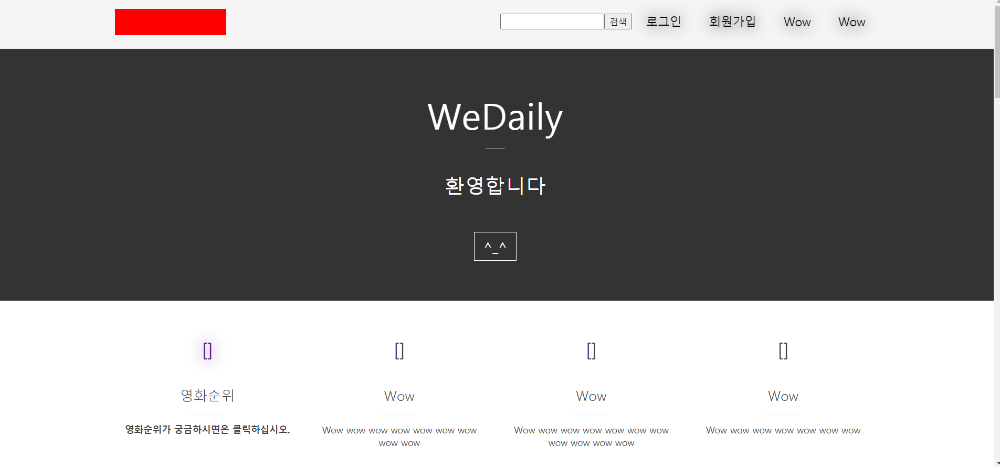

# 개요
● 프로젝트명 : wedaily

● 일정 : 2020.7.5 ~ 진행중

● 팀구성 : 유영규

● 목적 : 사용자가 생활속에서 영화정보든 유익한 정보들을 편리하게 이용할 수 있도록 하는 프로젝트이다.

● 사용기술 및 개발환경 ○ O/S : Windows 10(개발환경)

    ○ Server : Tomcat8.5

    ○ DB : PostgreSQL

    ○ Pramework : Spring boot, Jquery, mybatis

    ○ Programming Language : JAVA, HTML, Javascript, CSS
    
    ○ Tool : Eclipse

# 목적
● 해당 프로젝트는 나라에서 오로지 API를 이용하여 만들기위한 프로젝트이다.
● 여러형태의 API에 대한 이해도를 높이고 JSON에대한 친밀도를 높이기 위한 목적 

# 기획
● 처음에는 영화정보만 확인할 수 있게 기획하여 시작하였지만 프로젝트명 답게 생활속 유익한 여러기능들을 사용할 수 있도록 기획

● 회원들은 찜을 할 수 있는 기능들을 제공되며 그에맞는 추천하는 기능을할 수 있도록 기획

# 프로젝트 주요 기능
● 회원가입 및 로그인, 로그아웃 기능

● 휴대폰 문자인증 기능 

● 좋아하는 영화를 찜 할수있는 기능

● 현제 상영중인 영화순위리스트, 영화검색 기능

# 사용기술
● Spring boot, Mybastis, java, javascript, jquery, PostgreSQL

# 메인화면

# WeDaily-
네이버 API에서 제공하는 검색기능을 이용하여 내가 보고싶은 영화검색 or 내가 볼 영화를 찜해 놓을 수 있는 프로젝트
