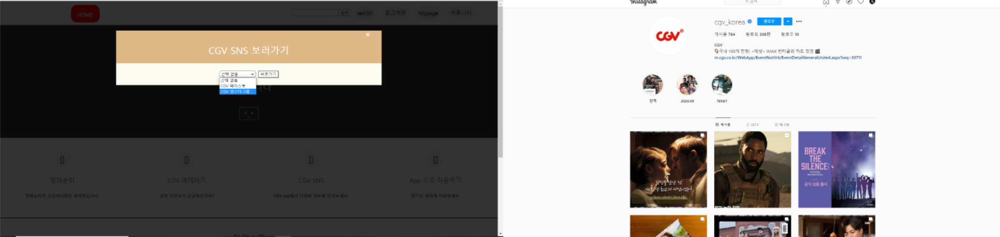

# 개요
● 프로젝트명 : wedaily

● 팀구성 : 유영규

● 목적 : 사용자가 생활속에서 영화정보든 유익한 정보들을 편리하게 이용할 수 있도록 하는 프로젝트이다.

● 사용기술 및 개발환경 ○ O/S : Windows 10(개발환경)

    ○ Server : Tomcat8.5

    ○ DB : PostgreSQL

    ○ Pramework : Spring boot, Jquery, mybatis

    ○ Programming Language : JAVA, HTML, Javascript, CSS
    
    ○ Tool : Eclipse

# 목적
● 해당 프로젝트는 API,크롤링을 활용하여 만든 프로젝트이다.
● API,크롤링에 대한 이해도,친밀도를 높이기 위한 목적

# 기획
● 처음에는 영화정보만 확인할 수 있게 기획하여 시작하였지만 프로젝트명 답게 생활속 유익한 여러기능들을 사용할 수 있도록 기획

● 회원들은 찜을 할 수 있는 기능들을 제공되며 그에맞는 추천하는 기능을할 수 있도록 기획

# 프로젝트 주요 기능
● 회원가입 및 로그인, 로그아웃 기능

● 휴대폰 문자인증 기능 

● 좋아하는 영화를 찜 할수있는 기능

● 현제 상영중인 영화순위리스트, 영화검색 기능

● 현재 상영중인 상영관,상영시간을 확인 후 예매사이트 이동 기능

● CGVsns [ 페이스북, 인스타그램 ] 이동

● QR코드로 app으로 이동할 수 있는기능 

# 사용기술
● Spring boot, Mybastis, java, javascript, jquery, PostgreSQL

# 메인화면

# 로그인,회원가입

▶ 회원가입할때는 간단한 핸드폰인증을 거쳐야 가입이 가능합니다. 

# 영화순위

- 영화순위는 메인화면에서 (일간,주간,주말)3개중 1개를 선택해서 볼 수 있습니다.
- 영화진흥위원회에서 제공하는 RestAPI를 사용하여 일간,주간,주말 에 영화순위들의 정보를 얻어왔습니다.

# 영화 상영관 시간표 

- 해당지역 -> 특정 상영관 -> 상영중인 상영관,시간표를 보실 수 있습니다.
- 해당 정보들은 크롤링을 하여 정보들을 얻어와 활용하였습니다.

# CGV SNS 보러가기

- Instagrame , FaceBook CGV에서 운영하는 2개의 SNS로 이동할 수 있습니다.

# App 연동

- 휴대폰으로 QR코드를 인식하게 되면은 CGV전용 앱으로 이용이 가능합니다.

# 게시판 메인

- 게시글을 등록하실 때 에디터로 이미지같은것을 손쉽게 첨부가능합니다.
- 에디터는 summernote 에디터 사용.

# WeDaily-
일상 생활에서 흔히 접할 수 있는 영화의 정보들을 볼 수 있고 상영중인 영화시간 CGV에 대한 다양한 이벤트,정보를 볼 수 있는  프로젝트이다.